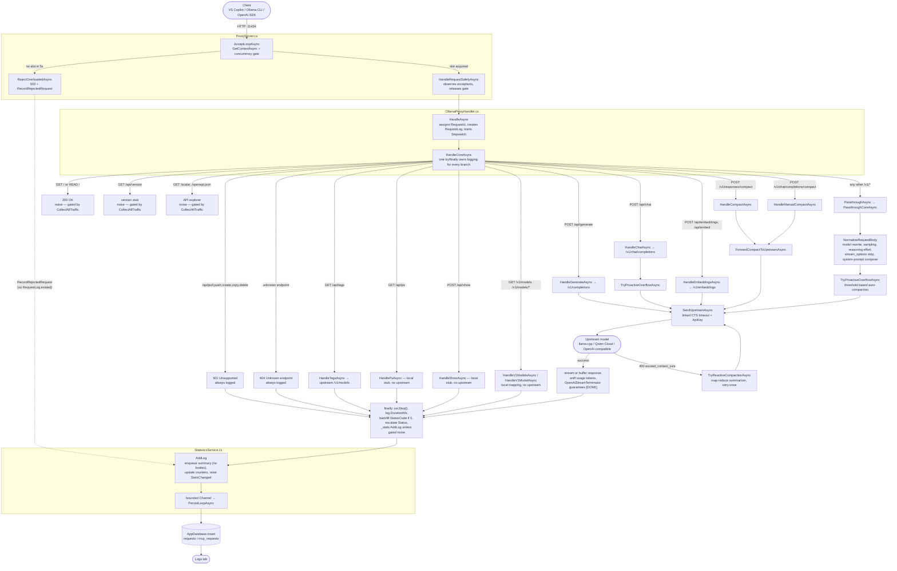

# Proxy Request Data Flow & Logging Coverage

How a request travels from client to model, the functions it passes through, and where the
request log does and does not get an entry.

---

## 1. End-to-end flow



---

## 2. Functions along the path

| Function | File | What it does |
|---|---|---|
| `AcceptLoopAsync` | ProxyServer.cs | Accepts connections, enforces the concurrency limit via a `SemaphoreSlim`. |
| `RejectOverloadedAsync` | ProxyServer.cs | Answers 503 when no concurrency slot frees within 5 s. Runs **before** any `RequestLog` exists, so it records the rejection through `RecordRejectedRequest`. |
| `HandleRequestSafelyAsync` | ProxyServer.cs | Dispatches to the handler, swallows benign disconnects, always closes the response and releases the slot. |
| `HandleAsync` | OllamaProxyHandler.cs | Entry point. Generates the 12-char `RequestId`, creates the `RequestLog`, pushes the id into Serilog's `LogContext`, starts the stopwatch. |
| `HandleCoreAsync` | OllamaProxyHandler.cs | CORS/preflight, health probes, the whole routing table, and the three `catch` blocks (cancel / oversized body / unhandled). One `try`/`finally` wraps the entire body, so no branch can escape logging. |
| `RecordResponseStatus` | OllamaProxyHandler.cs | Records the code on the log entry, derives `Status`, then sets `resp.StatusCode`. Writes the log first because setting the response status throws once headers are committed. |
| `RecordRejectedRequest` | OllamaProxyHandler.cs | Logs a request `ProxyServer` shed before it reached `HandleAsync`. Infallible by design — it runs on a fire-and-forget overload path. |
| `RequestLog.DeriveStatus` | RequestLog.cs | The single rule mapping an HTTP code to a `RequestStatus`. Treats 499 as `Cancelled` and 0 as `Error`. |
| `GetClientAddress` | OllamaProxyHandler.cs | Renders `req.RemoteEndPoint` as a display string for caller attribution, normalising IPv4-mapped IPv6 to plain IPv4. Mirrors the MCP host's helper so both log views show addresses the same way. |
| `NormalizeRequestBody` | OllamaProxyHandler.cs | Rewrites `model`, applies sampling and reasoning-effort priorities, strips `stream_options` under Copilot compatibility, composes the system prompt, applies the `/compact` redirect. Returns the original text untouched when nothing needs rewriting. |
| `SystemPromptComposer.Merge` | SystemPromptComposer.cs | Folds instruction-set text plus all leading system messages into exactly one system message. |
| `ResolveEffectiveModel` | OllamaProxyHandler.cs | Detects a Copilot `/compact` summary request and redirects it to the configured compaction model. |
| `TryProactiveOverflowAsync` | OllamaProxyHandler.cs | Compacts ahead of the upstream call when the token estimate crosses the mapping's threshold. |
| `TryReactiveCompactionAsync` | OllamaProxyHandler.cs | Compacts and retries once after the upstream rejects with a context-overflow error. |
| `SendUpstreamAsync` | OllamaProxyHandler.cs | The single upstream call site. Applies the per-mapping timeout through a linked `CancellationTokenSource` and attaches the API key. |
| `OpenAiStreamTerminator` | Translation/OpenAiStreamTerminator.cs | Guarantees the SSE stream reaches `data: [DONE]` (and a synthesized usage chunk) so Copilot never hangs. |
| `HandleGenerateAsync` | OllamaProxyHandler.cs | Translates Ollama `/api/generate` into `/v1/completions`. |
| `HandleChatAsync` | OllamaProxyHandler.cs | Translates `/api/chat` into `/v1/chat/completions`, correlating tool-call ids. |
| `HandleEmbeddingsAsync` | OllamaProxyHandler.cs | Translates `/api/embeddings` and `/api/embed` into `/v1/embeddings`. |
| `PassthroughCoreAsync` | OllamaProxyHandler.cs | Forwards OpenAI-native `/v1/*` requests with the normalized body. Stores the **upstream** status code. |
| `ForwardCompactToUpstreamAsync` | OllamaProxyHandler.cs | Shared body of both manual `/compact` endpoints. Bypasses `NormalizeRequestBody` deliberately. |
| `TryWriteErrorResponseAsync` | OllamaProxyHandler.cs | Best-effort error delivery from a `catch`. Records the status, then returns `false` when the response already started. |
| `RecordUndeliverableError` | OllamaProxyHandler.cs | Notes that the client received a truncated response, and records the intended status code since the response object is unusable. |
| `AddLog` | StatisticsService.cs | Enqueues a body-free summary for the GUI, updates counters, hands the full entry to the persistence channel. |
| `PersistLoopAsync` | StatisticsService.cs | Single writer draining the bounded channel into SQLite off the request path. |
| `Insert` | AppDatabase.cs | Writes the row into `requests` or `mcp_requests`, persisting exception detail in its own transaction. |

---

## 3. Request-log coverage

Every request that reaches the proxy process is logged with the status the client was actually
given. This section describes the gaps that existed and how they were closed.

### The bug that was fixed

`RequestLog` defaults made an error indistinguishable from a success:

```csharp
public RequestStatus Status { get; set; } = RequestStatus.Success;   // enum member 0
public int StatusCode { get; set; }                                 // 0
```

No proxy-originated error path overrode them. `log.StatusCode` was assigned in sixteen places, every
one a success path, an upstream-status copy, or a `CollectAllTraffic` stub. The result:

| Response | Before | After |
|---|---|---|
| **404** unknown endpoint | Success, code 0 — **looked normal** | Error, code 404 |
| **501** model-management | Error, code 0 | Error, code 501 |
| **499** cancelled | Cancelled, code 0 | Cancelled, code 499 |
| **413** body too large | Error, code 0 | Error, code 413 |
| **500** unhandled | Error, code 0 | Error, code 500 |
| **400** malformed body | Error, code 0 | Error, code 400 |
| 200 upstream success | correct | correct |

The 404 was the worst case: it set neither field, so an unrecognised caller — a scanner, a
misconfigured client, an endpoint this proxy does not implement — was **indistinguishable from a
successful request** and could not be found by any filter.

### The two paths that produced no row at all

Both are now logged:

1. **503 overload rejection** — `RejectOverloadedAsync` runs in `ProxyServer` before `HandleAsync`
   is called, so no `RequestLog` existed and no logging `finally` could run. It now calls
   `OllamaProxyHandler.RecordRejectedRequest` **before** attempting the response write, since the
   client may already be gone but the request was still answered on the proxy's port.
2. **`GET /` and `HEAD /` health probes** — these returned before the `try` that owns the logging
   `finally`. `HandleCoreAsync` now wraps its entire body in one `try`/`finally`, so every branch is
   covered. These are classified as infrastructure noise (see below).

### What `CollectAllTraffic` means now

It gates **infrastructure noise only** — the responses that are answered without touching a model
and would otherwise dominate the log:

| Endpoint | Logged when off | Logged when on |
|---|---|---|
| `GET /`, `HEAD /` health probe | no | yes |
| `OPTIONS` CORS preflight | no | yes |
| `GET /api/version` | no | yes |
| `GET /scalar` | no | yes |
| `GET /openapi/v1/openapi.json` | no | yes |

**Everything else is logged unconditionally** — every API request and every error, including 404s.
An unrecognised endpoint stays visible with the checkbox left at its default, which is the point.

### Caller attribution

Logging *every* request made the noise problem obvious: a `HEAD /` probe produces a row with no
model, no upstream, and no body — nothing to tell you **who** sent it. Every request now captures
the caller's identity so any row is traceable:

| Field | Source | Why it helps |
|---|---|---|
| `ClientAddress` | `req.RemoteEndPoint` (IPv4-mapped IPv6 normalised) | Identifies the socket the request came from |
| `UserAgent` | `req.UserAgent` | Names the calling tool — a VS probe vs a browser vs a script — in one glance |

Both are set once in `HandleAsync` and in `RecordRejectedRequest`, so every path that produces a row
is attributed, including the pre-routing 503. They are persisted as nullable columns on `requests`
and `mcp_requests` (baseline DDL **and** an `AddColumnIfMissing` migration, so an existing database
gains them), and the detail pane shows a `Client` / `Agent` line after `Path` — only when present, so
older rows simply omit it.

This does **not** change what is logged: probes are still gated by `CollectAllTraffic`. Attribution
only makes those rows actionable *when* you turn noise capture on to see who is probing.

### Still out of scope

Truly malformed HTTP — bad request line, invalid headers, garbage bytes — is rejected by Windows
`http.sys` with a 400 *before any managed code runs*. `HttpListener` exposes no callback for it, so
no row is possible. Capturing that layer would require replacing `HttpListener` with a raw
`TcpListener` plus hand-rolled HTTP parsing.

---

## 4. How it is implemented

### One derivation rule

`RequestLog.DeriveStatus` — the only place a status code becomes a `RequestStatus`:

```csharp
internal static RequestStatus DeriveStatus(int statusCode) => statusCode switch
{
    499 => RequestStatus.Cancelled,
    >= 400 => RequestStatus.Error,
    0 => RequestStatus.Error,   // no response recorded
    _ => RequestStatus.Success,
};
```

`0 → Error` matters because `RequestStatus` defaults to `Success`: an unanswered request silently
appearing successful is exactly what made these errors invisible. `499 → Cancelled` keeps a user
abandoning a request out of the error count, so it is not charged against upstream reliability.

### Log before the response

`RecordResponseStatus` — every proxy-originated error goes through here:

```csharp
private static void RecordResponseStatus(HttpListenerResponse resp, RequestLog log, int statusCode)
{
    log.StatusCode = statusCode;              // ← written first
    log.Status = RequestLog.DeriveStatus(statusCode);
    resp.StatusCode = statusCode;             // can throw once headers committed
}
```

`HttpListenerResponse.StatusCode` throws once headers are committed, which a streaming request does
early for SSE. Recording first means the entry still carries the code the proxy intended to send.

### Backfill in the `finally`

`HandleCoreAsync`'s single `finally` is the safety net, so no future branch can silently log a
success. Two constraints it has to respect:

- **Only fills a zero.** `PassthroughCoreAsync` stores the *upstream* status, and `HandleChatAsync`
  deliberately records the upstream 400 while rewriting the client-facing code to 413. An
  unconditional overwrite would corrupt both.
- **Only escalates, never downgrades.** The passthrough failure at "headers already committed" sets
  `Status = Error` while leaving `StatusCode` at the upstream's **200**, because that status line is
  already on the wire. Deriving unconditionally would flip a real failure back to `Success` —
  reintroducing the original bug class. So the derived status is applied only when the entry is
  still at its `Success` default.

Reading `resp.StatusCode` after `Close()` can throw, so it is wrapped; a failure leaves the code at
0, which `DeriveStatus` treats as an error — the safe direction.

The unhandled-exception handler logs the entry itself (to attach exception detail), so the `finally`
skips both the backfill and the second `AddLog`. That matters beyond avoiding a duplicate row:
`AddLog` hands the *same* `RequestLog` instance to the background persistence channel, so mutating
it afterwards would race that write.

### Precedent

`McpServerHost.HandleRequestSafeAsync` (lines 253–254) already derived both fields in one place. The
proxy now does the same, with the two caveats above that the MCP host does not have to handle.

### Test coverage

`RequestLoggingCoverageTests` binds a real `HttpListener` on an ephemeral loopback port and drives it
over HTTP, because the bug lived in the control flow *around* the handlers — branches returning
before the logging `finally`, and error paths answering without recording. A handler-level unit test
cannot observe either failure. Eight listener cases: unknown endpoint → 404, `/api/pull` → 501,
malformed JSON → 400, `/api/ps` → 200, health probe not logged with noise capture off, health probe
logged with it on, unknown endpoint logged **even with noise capture off**, and the 503 shed path.

Two further tests pin caller attribution with a real SQLite round-trip — `Insert` then
`LoadFullLogEntry` — asserting `ClientAddress`/`UserAgent` come back intact, and that a row with no
attribution reloads as `null` rather than empty. These also guard the column/ordinal alignment
between the 30-column `INSERT` and the two `SELECT`s that share `ReadRequestLog`: a misaligned
ordinal would read the wrong field and fail here instead of silently corrupting the GUI.

One race surfaced while writing them and is worth knowing about: a handler writes and closes the
response *before* the logging `finally` runs, so the client can observe the status code while the
entry does not exist yet. The tests poll `TotalRequests` rather than asserting immediately.

