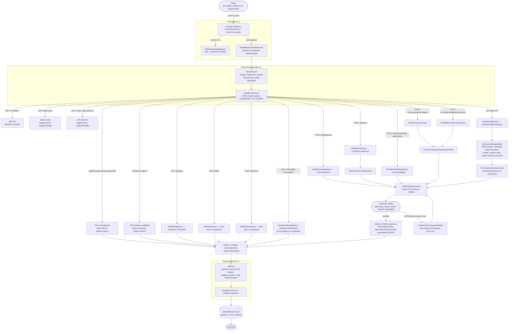

# Proxy Request Data Flow & Logging Coverage

How a request travels from client to model, the functions it passes through, and where the
request log does and does not get an entry.

---

## 1. End-to-end flow



---

## 2. Functions along the path

| Function | File | What it does |
|---|---|---|
| `AcceptLoopAsync` | ProxyServer.cs | Accepts connections, enforces the concurrency limit via a `SemaphoreSlim`. |
| `RejectOverloadedAsync` | ProxyServer.cs | Answers 503 when no concurrency slot frees within 5 s. Runs **before** any `RequestLog` exists. |
| `HandleRequestSafelyAsync` | ProxyServer.cs | Dispatches to the handler, swallows benign disconnects, always closes the response and releases the slot. |
| `HandleAsync` | OllamaProxyHandler.cs | Entry point. Generates the 12-char `RequestId`, creates the `RequestLog`, pushes the id into Serilog's `LogContext`, starts the stopwatch. |
| `HandleCoreAsync` | OllamaProxyHandler.cs | CORS/preflight, health probes, the whole routing table, and the four `catch` blocks (cancel / oversized body / unhandled). Owns the `finally` that persists the log. |
| `NormalizeRequestBody` | OllamaProxyHandler.cs | Rewrites `model`, applies sampling and reasoning-effort priorities, strips `stream_options` under Copilot compatibility, composes the system prompt, applies the `/compact` redirect. Returns the original text untouched when nothing needs rewriting. |
| `SystemPromptComposer.Merge` | SystemPromptComposer.cs | Folds instruction-set text plus all leading system messages into exactly one system message. |
| `ResolveEffectiveModel` | OllamaProxyHandler.cs | Detects a Copilot `/compact` summary request and redirects it to the mapping's configured compaction model. |
| `TryProactiveOverflowAsync` | OllamaProxyHandler.cs | Compacts ahead of the upstream call when the token estimate crosses the mapping's threshold. |
| `TryReactiveCompactionAsync` | OllamaProxyHandler.cs | Compacts and retries once after the upstream rejects with a context-overflow error. |
| `SendUpstreamAsync` | OllamaProxyHandler.cs | The single upstream call site. Applies the per-mapping timeout through a linked `CancellationTokenSource` and attaches the API key. |
| `OpenAiStreamTerminator` | Translation/OpenAiStreamTerminator.cs | Guarantees the SSE stream reaches `data: [DONE]` (and a synthesized usage chunk) so Copilot never hangs. |
| `HandleGenerateAsync` | OllamaProxyHandler.cs | Translates Ollama `/api/generate` into `/v1/completions`. |
| `HandleChatAsync` | OllamaProxyHandler.cs | Translates `/api/chat` into `/v1/chat/completions`, correlating tool-call ids. |
| `HandleEmbeddingsAsync` | OllamaProxyHandler.cs | Translates `/api/embeddings` and `/api/embed` into `/v1/embeddings`. |
| `PassthroughCoreAsync` | OllamaProxyHandler.cs | Forwards OpenAI-native `/v1/*` requests with the normalized body. |
| `ForwardCompactToUpstreamAsync` | OllamaProxyHandler.cs | Shared body of both manual `/compact` endpoints. Bypasses `NormalizeRequestBody` deliberately. |
| `TryWriteErrorResponseAsync` | OllamaProxyHandler.cs | Best-effort error delivery from a `catch`. Returns `false` when the response already started. |
| `RecordUndeliverableError` | OllamaProxyHandler.cs | Notes on the log entry that the client received a truncated response. |
| `AddLog` | StatisticsService.cs | Enqueues a body-free summary for the GUI, updates counters, hands the full entry to the persistence channel. |
| `PersistLoopAsync` | StatisticsService.cs | Single writer draining the bounded channel into SQLite off the request path. |
| `Insert` | AppDatabase.cs | Writes the row into `requests` or `mcp_requests`, persisting exception detail in its own transaction. |

---

## 3. Why invalid calls look unlogged

**They are being logged — they are mislabelled.** The `finally` block in `HandleCoreAsync` calls
`_stats.AddLog(log)` unconditionally, so every request that reaches the routing table produces a
row. What is missing is the status metadata, which makes those rows invisible to any error filter.

`RequestLog` defaults are the root cause:

```csharp
public RequestStatus Status { get; set; } = RequestStatus.Success;   // enum member 0
public int StatusCode { get; set; }                                 // 0
```

Nothing in the error paths overrides them, so an error is recorded as a success.

| Response | Sets `Status`? | Sets `StatusCode`? | How it appears in the log |
|---|---|---|---|
| **404** unknown endpoint (line 1146) | ❌ no | ❌ no | **Success, code 0** — looks like a normal request |
| **501** model-management (line 1107) | ✅ Error | ❌ no | Error, code 0 |
| **499** cancelled (line 1157) | ✅ Cancelled | ❌ no | Cancelled, code 0 |
| **413** body too large (line 1171) | ✅ Error | ❌ no | Error, code 0 |
| **500** unhandled (line 1190) | ✅ Error | ❌ no | Error, code 0 |
| 200 upstream success (line 1638) | ✅ | ✅ | correct |

`log.StatusCode` is assigned in sixteen places in `OllamaProxyHandler`, every one of them a success
path, an upstream-status copy, or a `CollectAllTraffic` stub. **No proxy-originated error path ever
sets it** — not the 404, not the 501, not the 499/413/500 catch blocks. That is why the 404s you are
looking for cannot be found by status code, and why a 404 is worse than the others, since it is not
even flagged as an error.

The handler-level error branches do set `log.Status`, so they at least appear under an Error filter
with a blank code. The 404 branch sets neither, so an unknown-endpoint call is indistinguishable
from a successful one.

### Genuinely never logged

These two produce a response on your port with no row at all:

1. **503 overload rejection** — `RejectOverloadedAsync` runs in `ProxyServer` before
   `HandleAsync` is called, so no `RequestLog` is ever constructed.
2. **`GET /` and `HEAD /` health probes** — `HandleCoreAsync` returns before the `try`, bypassing
   the `finally`. Deliberate, to keep load-balancer noise out of the log, but it means probes are
   invisible even under `CollectAllTraffic`.

### Logged only under `CollectAllTraffic`

`OPTIONS` preflight, `GET /api/version`, `GET /scalar`, and `GET /openapi/v1/openapi.json` each
return early and call `_stats.AddLog` only inside an `if (_settings.CollectAllTraffic)` guard.
With that setting off they leave no trace.

---

## 4. What a fix looks like

The gap is that status metadata is set at each individual `resp.StatusCode = N` assignment, so
any path that forgets it silently logs a success. Two options:

**Minimal** — set `log.Status` and `log.StatusCode` in the five error branches (404, 501, 499,
413, 500), and add the same to `RecordUndeliverableError`, which already receives the status code.

**Structural** — copy the pattern the MCP host already uses. `McpServerHost.HandleRequestSafeAsync`
(lines 253-254) derives both fields from the response in one place, after handling:

```csharp
log.StatusCode = context.Response.StatusCode;
log.Status = log.StatusCode >= 400 ? RequestStatus.Error : RequestStatus.Success;
```

Its catch blocks then set explicit codes (499 for a disconnect, 500 for unhandled) so nothing falls
through to a default. Applying the same backfill in `HandleCoreAsync`'s `finally` makes every proxy
error branch self-describing, and no future branch can silently log a success.

Two caveats for the proxy that the MCP host does not have to handle:

- A streaming request pre-commits SSE headers, so `resp.StatusCode` may not reflect what the client
  actually received. Prefer the code passed to `TryWriteErrorResponseAsync`, and only fall back to
  `resp.StatusCode`.
- `PassthroughCoreAsync` sets `log.StatusCode` from the *upstream* response. A backfill must not
  overwrite that with the proxy's own status.

The structural option also makes the 503 loggable, since `RejectOverloadedAsync` would need a
`RequestLog` to hand to it.
